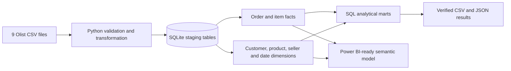
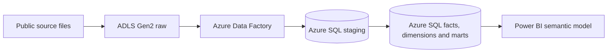

# Marketplace Customer Growth and Fulfilment Analytics

**Independent portfolio project | SQL | Python | Power BI-ready model | Azure deployment blueprint**

## Business brief

This project asks a decision-oriented question:

> How can an e-commerce marketplace improve the quality of delivered GMV growth by increasing second purchases and improving the post-purchase experience, while prioritising commercially important customer, category and regional segments?

It is not a generic sales dashboard. The analysis separates four decisions:

1. Is growth coming from customer acquisition, repeat purchasing, or order value?
2. Which observed customer segments should CRM teams prioritise?
3. Where is delivery performance most strongly associated with poor customer experience?
4. Which category and regional combinations require commercial or operational attention?

## Data

The project uses the [Brazilian E-Commerce Public Dataset by Olist](https://www.kaggle.com/olistbr/brazilian-ecommerce/home). Olist describes it as real, anonymised commercial data covering approximately 100,000 orders from 2016 to 2018. The nine files include customers, orders, order items, products, sellers, payments, reviews, geolocation and an English category translation.

The local pipeline processes **1,550,922 source rows**, including **96,478 delivered orders** and **93,358 observed customers**.

Important definitions:

- **Delivered GMV** is the sum of item `price` for delivered orders. It is a GMV proxy, not Olist revenue, profit or margin.
- **Repeat customer** means a `customer_unique_id` with at least two delivered orders inside the observed period.
- **90-day second-purchase rate** excludes first-time customers without a complete 90-day observation window.
- **On-time delivery** means actual customer delivery date was on or before the estimated date.
- **Low review** means an observed review score of 1 or 2.

## What is implemented

- Python ingestion, cleaning, feature engineering and repeatable data-quality tests across all nine source files.
- A local SQLite analytical database containing staging tables, separate order- and item-level facts, conformed dimensions and reusable SQL marts.
- SQL CTEs and window functions for monthly performance, customer lifecycle, cohort retention, repeat-purchase windows, category/state performance, payment mix and delivery experience.
- Power BI-ready fact, dimension and customer-segmentation CSVs.
- A documented Power BI semantic model, DAX library and five-page dashboard specification.
- A documented Azure proof-of-concept deployment path using ADLS Gen2, Azure Data Factory, Azure SQL Database and Power BI.

The Azure resources and Power BI report are **not represented as deployed in this repository**. The documentation distinguishes the current local implementation from claims that can only be used after a verified cloud deployment and dashboard build.

## Analytical architecture



Target Azure proof of concept:



Microsoft documents the same core Blob/ADLS-to-Azure SQL copy pattern for [Azure Data Factory](https://learn.microsoft.com/en-us/azure/data-factory/tutorial-copy-data-tool), and Power BI supports an [Azure SQL Database connector](https://learn.microsoft.com/en-us/power-query/connectors/azure-sql-database).

## Data model

The project deliberately keeps different grains separate:

- `fact_orders`: one row per order; used for status, customer, delivery, review, payment and order-level KPIs.
- `fact_sales`: one row per order item; used for product, category, seller, item GMV and freight analysis.
- `dim_customer`: one row per `customer_unique_id`, using the latest observed location.
- `dim_product`: one row per product with translated category and product attributes.
- `dim_seller`: one row per seller.
- `dim_date`: one row per calendar date.
- `mart_customer_rfm`: one row per observed customer with recency, frequency, observed GMV and a transparent rule-based segment.

This prevents a common analytical error: joining multiple order items, multiple payments and multiple reviews directly on `order_id` creates fan-out duplication and overstates financial values. The pipeline aggregates each source to the required grain before order-level reconciliation.

## Verified findings

- Delivered GMV was **BRL 13.22 million**, with average order value of **BRL 137.04**.
- Jan-Jul 2018 delivered GMV was **161.6%** above Jan-Jul 2017; delivered orders grew **160.8%**.
- Only **3.00%** of observed customers placed at least two delivered orders. Repeat orders contributed **2.90%** of delivered GMV.
- The censoring-adjusted 90-day second-purchase rate was **2.28%** across **75,320** eligible customers.
- **91.9%** of delivered orders arrived by the estimated date.
- Late orders averaged **2.57/5** versus **4.29/5** for on-time or early orders.
- **54.0%** of reviewed late orders received a score of 1-2, compared with **9.2%** of reviewed on-time or early orders - a **5.9x association**, not a causal estimate.
- A rule-based `At-risk high-value` segment contained **12,790 customers**, or **13.7%** of observed customers, and represented **33.8%** of observed GMV.
- Sao Paulo represented **38.3%** of delivered GMV. On-time performance was **94.1%** in SP versus **86.5%** in RJ and **86.0%** in BA.

The full, reproducible summary is in [`results/executive_summary.md`](results/executive_summary.md).

## Recommendations

1. **Design a second-purchase test:** target eligible first-time customers in a defined post-purchase window and use second-purchase rate as the primary KPI.
2. **Prioritise delivery exceptions by commercial value:** investigate high-GMV seller/category/region combinations with low on-time rates instead of applying a blanket operational response.
3. **Create a reactivation test audience:** use the transparent `At-risk high-value` segment as a starting point, then test incrementality rather than assuming all historical high-value customers are recoverable.
4. **Investigate RJ and BA service gaps:** decompose their weaker on-time performance by seller, category, freight burden and route before recommending carrier or seller action.

## Reproduce the project

1. Download the Olist dataset and place the nine CSV files in `data/raw/`.
2. Create a Python environment and install the dependencies:

```bash
python -m venv .venv
source .venv/bin/activate
pip install -r requirements.txt
```

3. Build the facts, dimensions, SQLite database and validation report:

```bash
python src/build_project.py
```

4. Run the analysis and export all verified results:

```bash
python src/run_analysis.py
```

## Repository map

```text
data/raw/                       Source files (excluded from Git)
data/processed/                 SQLite database and Power BI-ready CSVs
src/build_project.py            Ingestion, validation and dimensional modelling
src/run_analysis.py             Business analysis and result exports
sql/01_create_analytics_views.sql
                                SQL marts, CTEs and window-function analysis
results/                        Reproducible metrics, data-quality output and summary
powerbi/POWER_BI_BUILD_GUIDE.md Semantic model, DAX and report pages
azure/AZURE_DEPLOYMENT_GUIDE.md Honest cloud proof-of-concept instructions
docs/PROJECT_EXPERIENCE.md       Resume bullets and interview story
docs/DATA_DICTIONARY.md          Grain, fields and KPI definitions
```

## Limitations

- The historical Brazil dataset demonstrates transferable methods; it does not represent current Australian customer behaviour.
- There are no visits, impressions, carts or marketing costs, so conversion, cart abandonment, CAC and ROAS cannot be calculated.
- There is no platform commission, inventory cost or cost of goods, so profit and margin cannot be calculated.
- Observed repeat purchasing is not lifetime retention or true customer lifetime value.
- Delivery and review patterns are observational and should not be described as causal effects.
- The final observation month is right-censored; fixed-window repeat rates exclude customers without enough follow-up time.

