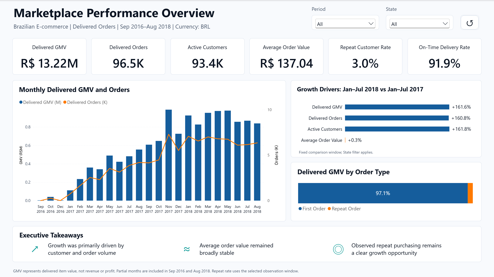
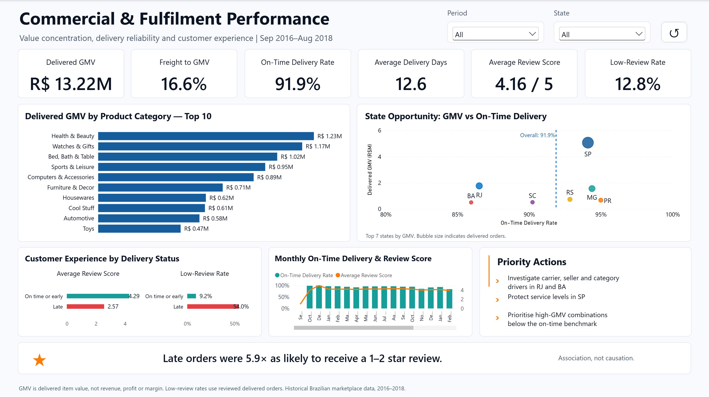

# Marketplace Customer Growth Analytics

**Python · SQL · Power BI | Independent portfolio project**

## Business question

How can a marketplace improve delivered GMV growth through second purchases and a better post-purchase experience—and which commercial or regional segments should it investigate first?

This project combines reproducible Python/SQL analysis with a two-page Power BI report using historical Brazilian e-commerce data from Olist. GMV is delivered item value, not revenue or profit.

## Dashboard previews

### 1. Marketplace Performance Overview

Growth, customer activity and first/repeat order contribution.

[](docs/images/marketplace-performance-overview.png)

### 2. Commercial & Fulfilment Performance

Category and state priorities, delivery reliability and customer reviews.

[](docs/images/commercial-fulfilment-performance.png)

These previews were captured from the existing PBIX in Power BI Desktop with all periods and states selected. See the [model and filter guide](docs/POWER_BI_MODEL.md) for the fixed-year comparison and State slicer behaviour.

## Three key findings

- **Growth was volume-led:** Jan–Jul 2018 delivered GMV increased **161.6%** versus Jan–Jul 2017; orders increased **160.8%**, while AOV rose about **0.3%**.
- **Observed repeat purchasing was limited:** **3.0%** of customers placed at least two delivered orders, and repeat orders contributed **2.9%** of GMV. A defined second-purchase journey is a candidate for testing.
- **Late delivery was associated with poorer reviews:** **54.0%** of reviewed late orders had low scores, versus **9.2%** of reviewed on-time/early orders (**5.9×**). This is an association, not a causal effect.

Full definitions, regional findings and limitations: [Metrics and data quality](docs/METRICS_AND_QUALITY.md).

## Download and quick start

[Download the Power BI report (.pbix, approximately 35.2 MiB)](https://github.com/Nell0413/Marketplace-customer-growth-analytics/raw/refs/heads/main/powerbi/Dashboard_Commercial_Fulfilment_Final.pbix). Open it in **Power BI Desktop on Windows**; its imported snapshot can be viewed without rebuilding the pipeline. [Opening and refresh instructions](powerbi/POWER_BI_BUILD_GUIDE.md).

For the analysis, use Python **3.10+** and place the nine original Olist CSVs in `data/raw/`. From the repository root, in your Python environment:

```bash
python -m pip install -r requirements.txt
python -m unittest discover -s tests -v
python src/build_project.py
python src/run_analysis.py
```

The tests use small fixtures, not the full dataset. For dataset setup, environment activation, generated outputs and running from another directory, see [Reproducibility](docs/REPRODUCIBILITY.md).

## Documentation

- [Power BI model, core DAX and filter logic](docs/POWER_BI_MODEL.md)
- [Metric definitions, quality evidence and limitations](docs/METRICS_AND_QUALITY.md)
- [Data dictionary](docs/DATA_DICTIONARY.md) · [Results and executive summary](results/executive_summary.md)
- [Azure deployment blueprint](azure/AZURE_DEPLOYMENT_GUIDE.md) — design only; no cloud deployment is claimed.
