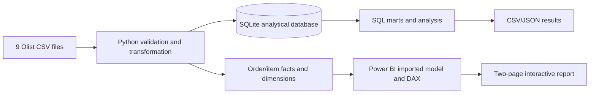

# Marketplace Customer Growth Analytics

**Python · SQL · Power BI · Customer Growth · Commercial & Fulfilment Analytics**

An independent analytics portfolio project exploring what drives marketplace growth and where delivery performance puts customer experience at risk. It combines a reproducible Python and SQL workflow with a completed **two-page Power BI report**, using public Brazilian e-commerce data from Olist.

**[Download the Power BI report](https://github.com/Nell0413/Marketplace-customer-growth-analytics/raw/refs/heads/main/powerbi/Dashboard_Commercial_Fulfilment_Final.pbix)** · [Dashboard previews](#dashboard-previews) · [Key findings](#key-findings) · [Reproduce the analysis](#reproduce-the-analysis)

| Delivered GMV | Delivered orders | Active customers | On-time delivery |
| :--- | :--- | :--- | :--- |
| **R$ 13.22M** | **96,478** | **93,358** | **91.9%** |

*Delivered orders purchased from September 2016 to August 2018. Currency: BRL. GMV is delivered item value, not platform revenue or profit.*

## Dashboard previews

### 1. Marketplace Performance Overview

An executive view of growth: monthly delivered GMV and orders, a comparable-period growth breakdown, first versus repeat order contribution, and the headline customer and delivery KPIs.

[](docs/images/marketplace-performance-overview.png)

**Decision supported:** assess whether growth comes from more customers and orders or higher order value, and identify the role of observed repeat purchasing.

### 2. Commercial & Fulfilment Performance

A commercial and operations view combining the top product categories, state-level GMV and on-time delivery, freight burden, delivery time, and customer reviews.

[](docs/images/commercial-fulfilment-performance.png)

**Decision supported:** prioritise commercially significant delivery gaps and investigate the association between late delivery and poor customer reviews.

Both pages include **Period** and **State** slicers and a reset control. The growth-driver visual uses the fixed **Jan–Jul 2018 versus Jan–Jul 2017** comparison; the State filter applies. Previews show all periods and states selected. Click an image to view it at full resolution.

## Open the Power BI report

1. [Download `Dashboard_Commercial_Fulfilment_Final.pbix`](https://github.com/Nell0413/Marketplace-customer-growth-analytics/raw/refs/heads/main/powerbi/Dashboard_Commercial_Fulfilment_Final.pbix) — approximately **35.2 MiB**.
2. Open it in **Microsoft Power BI Desktop on Windows**. The saved report includes its imported data model, so the existing pages can be viewed without rebuilding the Python pipeline.
3. Use the page tabs and slicers to explore the report. Save a local copy if you want to make changes.

GitHub displays the screenshots and documentation; the PBIX provides the interactive report in Desktop. To refresh the model on another computer, rebuild the source CSVs and update the local file connections as described in the [Power BI guide](powerbi/POWER_BI_BUILD_GUIDE.md#refresh-on-another-computer).

## Key findings

| Finding | Evidence | Business implication |
| :--- | :--- | :--- |
| Growth was driven mainly by volume | Jan–Jul delivered GMV grew **161.6%** year on year; orders grew **160.8%**, while AOV rose about **0.3%**. | Track customer and order growth alongside order value. |
| Repeat purchasing was limited in the observation window | **3.0%** of observed customers placed at least two delivered orders; repeat orders contributed **2.9%** of GMV. | Test a defined second-purchase journey. |
| Delivery performance varied by state | On-time delivery was **94.1% in SP**, **86.5% in RJ** and **86.0% in BA**. SP contributed **38.3%** of delivered GMV. | Protect service in the largest market and investigate regional exceptions. |
| Late delivery was associated with poorer reviews | **54.0%** of reviewed late orders received 1–2 stars, versus **9.2%** of reviewed on-time or early orders: **5.9×** the rate. | Investigate seller, category and delivery drivers; this is an association, not a causal estimate. |

The supporting SQL/Python analysis also covers cohort retention, fixed-window second purchases and rule-based RFM segments. It finds a **2.28%** 90-day second-purchase rate across **75,320** eligible customers, and an **At-risk high-value** segment containing **12,790** customers who account for **33.8%** of observed GMV. These analyses are available in `results/`; they are not additional pages in the two-page PBIX.

See the [executive summary](results/executive_summary.md) and [machine-readable headline metrics](results/headline_metrics.json) for supporting calculations. Recommendations are proposals for testing, not measured business outcomes.

## Data and metric definitions

**Source:** [Brazilian E-Commerce Public Dataset by Olist](https://www.kaggle.com/datasets/olistbr/brazilian-ecommerce). Nine source files cover customers, orders, items, products, sellers, payments, reviews, geolocation and category translations. The pipeline processes **1,550,922 source rows**.

| Metric | Definition |
| :--- | :--- |
| Delivered GMV | Sum of item `price` for delivered orders; excludes freight. |
| Delivered orders / active customers | Distinct delivered `order_id` / `customer_unique_id` within the selected observation window. |
| Average order value | Delivered GMV divided by delivered orders. |
| Repeat customer rate | Share of observed customers with at least two delivered orders in the selected observation window. |
| Repeat order GMV | GMV from a customer's second or later delivered order, sequenced across the available history. |
| Freight to GMV | Delivered freight value divided by delivered item GMV. |
| On-time delivery rate | Share of delivered orders marked on time: actual delivery on or before the estimated date. |
| Average review / low-review rate | Mean observed review score / share of reviewed delivered orders with a score of 1 or 2. |
| 90-day second-purchase rate | Share making a second delivered purchase within 90 days, restricted to customers with a complete follow-up window. |

The [data dictionary](docs/DATA_DICTIONARY.md) describes source fields, grains and analytical outputs.

## Implementation and data quality



- **Python:** ingestion, category translation, delivery/review features, repeat-order sequencing, dimensional exports and rule-based customer segmentation.
- **SQL:** reusable marts with CTEs and window functions for monthly performance, cohorts, second-purchase windows, category/state performance and delivery experience.
- **Power BI:** a saved imported model, DAX measures, two report pages and screenshots captured from the final PBIX in Desktop.
- **Azure:** an [ADLS Gen2 / Data Factory / Azure SQL deployment blueprint](azure/AZURE_DEPLOYMENT_GUIDE.md). Cloud deployment and Power BI Service publishing are not claimed.

`fact_orders` contains one row per order; `fact_sales` contains one row per order item. Keeping these grains separate avoids inflating monetary values when joining multiple items, payments and reviews. Customer, product, seller and date dimensions support analysis across the facts.

The committed [data-quality report](results/data_quality_report.json) records:

- **99,441 order rows** and **112,650 item rows**, including **96,478 delivered orders**.
- Zero duplicate keys in the tested source entities and zero orphan item references to orders, products or sellers.
- Zero negative item prices or freight values, and zero deliveries recorded before purchase.
- **R$ 0.00** delivered-GMV reconciliation difference between the order and item facts.
- **99.33%** review coverage among delivered orders; missing reviews are excluded from review-rate denominators.

## Reproduce the analysis

Use Python **3.10 or later**. Clone or download this repository, then obtain the nine Olist CSV files from the source link and place them in `data/raw/`. Keep their original filenames.

From the repository root:

```bash
python -m venv .venv
```

Activate the environment:

```powershell
# Windows PowerShell
.\.venv\Scripts\Activate.ps1
```

```bash
# macOS / Linux
source .venv/bin/activate
```

Install dependencies, build the analytical model, and export the results:

```bash
python -m pip install -r requirements.txt
python src/build_project.py
python src/run_analysis.py
```

The pipeline writes the SQLite database and model CSVs to `data/processed/`, and analytical outputs to `results/`. Raw and processed data directories are excluded from Git. The downloadable PBIX contains an imported analytical snapshot; refreshing it requires reconnecting its Power Query sources to the regenerated files.

## Repository guide

| Path | Contents |
| :--- | :--- |
| [`powerbi/`](powerbi/) | Final PBIX and instructions for opening, filtering and refreshing the report. |
| [`docs/images/`](docs/images/) | Two full-resolution previews of the final report. |
| [`src/build_project.py`](src/build_project.py) | Ingestion, validation, feature engineering and dimensional modelling. |
| [`src/run_analysis.py`](src/run_analysis.py) | Analytical queries and result exports. |
| [`sql/01_create_analytics_views.sql`](sql/01_create_analytics_views.sql) | SQL marts, CTEs and window-function analysis. |
| [`results/`](results/) | Metrics, data-quality evidence, cohort/RFM outputs and executive summary. |
| [`docs/DATA_DICTIONARY.md`](docs/DATA_DICTIONARY.md) | Table grains, fields and KPI definitions. |
| [`azure/AZURE_DEPLOYMENT_GUIDE.md`](azure/AZURE_DEPLOYMENT_GUIDE.md) | Optional cloud proof-of-concept architecture and deployment steps. |

## Scope and limitations

- This is an independent portfolio project using historical Brazilian marketplace data, with no affiliation to Olist. Findings do not describe current market behaviour.
- September 2016 and August 2018 are partial observation months. Observed repeat purchasing is not lifetime retention or customer lifetime value.
- There are no visits, carts or marketing costs, so conversion, cart abandonment, CAC and ROAS cannot be calculated. Platform commissions and costs are also unavailable, so GMV cannot be interpreted as revenue, profit or margin.
- Delivery and review results are observational. No intervention, retention uplift or operational improvement has been measured.
- Credit for the source data belongs to Olist and the dataset contributors; consult the original dataset page for its terms.
