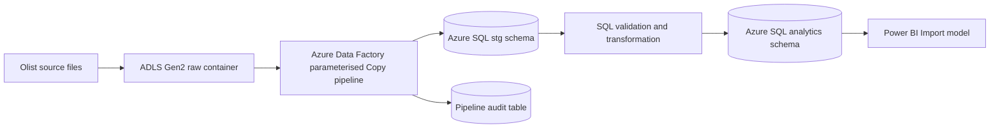

# Azure proof-of-concept deployment guide

## Current status and claim boundary

The repository currently implements the complete local Python and SQL workflow and provides an Azure-ready design. It does **not** prove that Azure resources have been deployed.

Current truthful wording:

> Designed an Azure-ready batch architecture using ADLS Gen2, Azure Data Factory, Azure SQL Database and Power BI, with separate raw, staging and analytical layers.

Only after completing and documenting the proof of concept below can the wording become:

> Implemented an Azure batch proof of concept that staged nine public e-commerce files in ADLS Gen2, orchestrated parameterised ingestion with Azure Data Factory, loaded a dimensional model into Azure SQL Database and served verified analytical tables to Power BI.

## Target architecture



Microsoft's official tutorial documents the [Blob-to-Azure SQL Data Factory pattern](https://learn.microsoft.com/en-us/azure/data-factory/tutorial-copy-data-tool). Power Query and Power BI support the [Azure SQL Database connector](https://learn.microsoft.com/en-us/power-query/connectors/azure-sql-database).

## Minimum viable proof of concept

### 1. Create resources

Create one resource group containing:

- StorageV2 account with hierarchical namespace enabled for ADLS Gen2
- Azure Data Factory
- Azure SQL logical server and small Azure SQL Database

Use a student/free subscription where available. Set a budget alert and delete resources after capturing reproducible evidence.

### 2. Create storage zones

Use containers or top-level folders:

```text
raw/olist/<file_name>.csv
curated/facts/<table_name>.csv
curated/dimensions/<table_name>.csv
audit/<run_id>.json
```

Upload the nine unmodified source CSVs to `raw/olist/`. Because the source is a static Kaggle snapshot, call this a reproducible batch ingestion demonstration, not a live feed.

### 3. Create Azure SQL schemas

Create:

```sql
CREATE SCHEMA stg;
CREATE SCHEMA analytics;
CREATE SCHEMA audit;
```

Load source-shaped tables into `stg`. Publish facts, dimensions and marts into `analytics`. Create an `audit.PipelineRun` table containing:

- run ID
- source file
- pipeline start/end time
- source rows
- written rows
- status
- error message

### 4. Configure linked services

Create linked services for:

- ADLS Gen2
- Azure SQL Database

Prefer managed identity and scoped role assignments. If a simpler student proof of concept temporarily uses SQL authentication or broader firewall access, document the limitation and do not commit credentials or connection strings.

### 5. Build a parameterised ADF pipeline

Recommended objects:

```text
pl_olist_ingest
  Lookup: file manifest
  ForEach: each source file
    Get Metadata: file exists and size
    Copy Activity: ADLS CSV -> Azure SQL stg table
    Stored Procedure: write audit result
```

Manifest columns:

```text
source_file
target_schema
target_table
load_order
enabled
```

Parameters:

- `p_source_folder`
- `p_file_name`
- `p_target_schema`
- `p_target_table`
- `p_run_id`

The pipeline should record source and sink row counts and fail when required files are missing.

### 6. Publish the analytical model

Two acceptable proof-of-concept routes:

**Route A - simplest and easiest to defend**

1. Run the verified local Python transformations.
2. Upload curated fact/dimension CSVs to ADLS.
3. Use ADF to copy the curated tables into Azure SQL.
4. Execute the analytical SQL views in Azure SQL.

Describe Python accurately as local transformation and validation code orchestrated separately from Azure.

**Route B - stronger Azure implementation**

1. Recreate the transformation logic in ADF Mapping Data Flows, Azure Functions or an Azure-hosted notebook.
2. Orchestrate it from ADF.
3. Store curated data and load Azure SQL.

Use Route B wording only if the transformation actually ran in Azure.

### 7. Connect Power BI

Connect Power BI to Azure SQL in Import mode, select the facts and dimensions, recreate the documented relationships and validate every headline measure against `results/headline_metrics.json`.

For this dataset size, Import mode is simpler and more responsive than claiming a DirectQuery requirement that does not exist.

## Validation evidence to retain

Capture:

1. ADLS folder structure containing the nine source files.
2. ADF pipeline canvas.
3. Successful pipeline run history.
4. Source and sink row counts for each file.
5. Azure SQL table/view list.
6. SQL query showing 96,478 delivered orders and BRL 13,221,498.11 delivered GMV.
7. Power BI connection and model view.
8. Final dashboard screenshots.

Keep screenshots in a portfolio folder without exposing subscription IDs, credentials, server addresses or personal information.

## Interview questions the deployment must withstand

- Why use ADF for static files?
- How does rerunning the pipeline avoid duplicate data?
- Why separate raw, staging and analytical layers?
- How are row counts and GMV reconciled?
- Which transformations ran locally and which actually ran in Azure?
- Why use Azure SQL rather than Synapse Dedicated SQL Pool?
- Why choose Power BI Import rather than DirectQuery?
- How were secrets and network access handled?
- What would need to change for incremental source files?
- What controls prevent an incomplete load from reaching Power BI?

For this volume, Azure SQL is proportionate. Adding Databricks, Synapse Dedicated Pool, streaming or real-time services would make the project harder to justify unless they solve a specific, implemented requirement.

