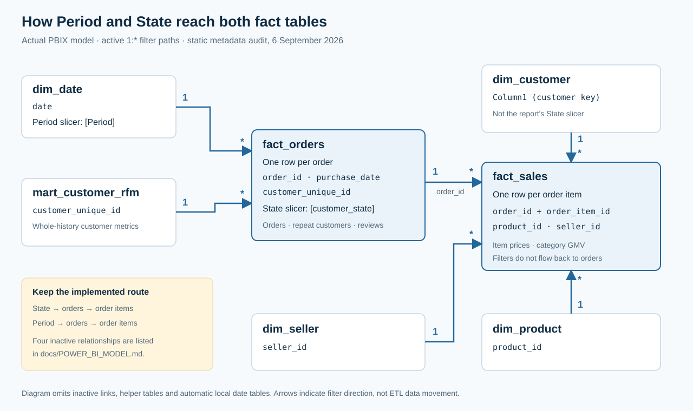

# Power BI model, DAX and filter behaviour

This document describes the model extracted from the delivered [PBIX](../powerbi/Dashboard_Commercial_Fulfilment_Final.pbix), not a proposed replacement schema. Model metadata and visual field bindings were inspected on **6 September 2026** using `pbixray 0.15.5` and the report's embedded PBIR JSON. This is static evidence: it does not establish that Power BI Desktop has executed a refresh or rendered every filter state successfully.

## 1. The implemented relationship model



The arrows show active filter propagation from the **one** side to the **many** side. The diagram omits inactive relationships and Power BI's automatic local date tables; the complete business-relationship inventory is below. `_Measures` stores measures, while the disconnected `Growth Metrics` table supplies the four growth-driver labels through `SWITCH`.

| One-side table and key | Many-side table and key | State | Filter direction |
| :--- | :--- | :--- | :--- |
| `dim_date[date]` | `fact_orders[purchase_date]` | Active | Date → orders |
| `mart_customer_rfm[customer_unique_id]` | `fact_orders[customer_unique_id]` | Active | Customer mart → orders |
| `fact_orders[order_id]` | `fact_sales[order_id]` | Active | Orders → order items |
| `dim_customer[Column1]` | `fact_sales[customer_unique_id]` | Active | Customer → order items |
| `dim_product[product_id]` | `fact_sales[product_id]` | Active | Product → order items |
| `dim_seller[seller_id]` | `fact_sales[seller_id]` | Active | Seller → order items |
| `dim_date[date]` | `fact_sales[purchase_date]` | Inactive | None unless explicitly activated |
| `mart_customer_rfm[customer_unique_id]` | `fact_sales[customer_unique_id]` | Inactive | None unless explicitly activated |
| `dim_customer[Column1]` | `fact_orders[customer_unique_id]` | Inactive | None unless explicitly activated |
| `mart_customer_rfm[customer_unique_id]` | `dim_customer[Column1]` | Inactive, **1:1** | Both, only if activated |

`fact_orders` has one row per order; `fact_sales` has one row per order item. Thus order-level reviews and delivery measures must use `fact_orders`, while category GMV uses item prices in `fact_sales`. Summing reviews or order freight over an unaggregated item join would over-weight multi-item orders.

The direct date-to-sales relationship is intentionally inactive in the delivered file: date filters already reach sales through orders. Do not activate every relationship or switch them all to bidirectional filtering. Power BI propagates filters along active relationship paths; additional routes can create ambiguity. See [Microsoft's relationship documentation](https://learn.microsoft.com/en-us/power-bi/transform-model/desktop-relationships-understand).

### An important implementation limitation

`dim_customer` retains legacy column names: `Column1` is the customer key, `Column2` is the city, and `State` is the state. Its original M query did not promote CSV headers. The relationship documentation deliberately preserves these actual names instead of drawing a cleaner but inaccurate model.

The page's State slicer must **not** be replaced with `dim_customer[State]` without redesigning and retesting the model: that dimension directly filters item sales, but its relationship to order facts is inactive. Product and seller selections likewise filter item metrics, not order-level delivery/review metrics, under the current one-way model. In particular, do not interpret a category selection as a category-specific review or freight-to-GMV calculation. Cross-visual interaction settings must be checked in Desktop before extending category-driven interactions to mixed-grain cards.

## 2. What the actual slicers filter

Both delivered pages bind **Period** to `dim_date[Period]` and **State** to `fact_orders[customer_state]`.

| Selection / measure | Order-level result | Item-level result | Exception or interpretation |
| :--- | :--- | :--- | :--- |
| Period slicer | Filters `fact_orders` through `purchase_date` | Filters `fact_sales` through the selected order IDs | Uses order purchase dates, not review or delivery dates |
| State slicer | Directly filters the orders' recorded customer state | Selected order IDs filter item rows | Uses the state recorded for each order, not the customer's latest dimension state |
| Repeat Customer Rate | Recounts delivered orders per customer in the selection | Not an item-level rate | A customer can qualify in the full window but not in a single month |
| Fixed Jan–Jul growth measures | Remove `dim_date` filters and apply fixed comparison dates | Same date policy propagates through orders | State selection is retained |
| Overall On-Time Benchmark | Removes only `fact_orders[customer_state]` | Not an item-level measure | Keeps the selected period; intended to compare with all states |
| First / Repeat Order GMV | Uses the precomputed historical order-sequence flag | Adds matching item prices | A customer's second historical order remains a repeat order even if the first is outside the selected period |
| Observed Repeat Customer % | Reads the precomputed customer mart | Not the page's repeat-rate card | Legacy whole-history measure; not equivalent to the selection-aware rate |

The reset button uses `ClearAllSlicers` for the current page. Static explanatory and priority-action text is historical context; it should not be read as a newly calculated recommendation after filtering.

## 3. Core DAX from the delivered file

The expressions below preserve the implemented logic, with whitespace added for readability. `CALCULATE` changes filter context, and `DIVIDE` returns blank by default when a denominator is zero. See Microsoft's [CALCULATE](https://learn.microsoft.com/en-us/dax/calculate-function-dax) and [DIVIDE](https://learn.microsoft.com/en-us/dax/divide-function-dax) references.

### Delivered GMV and order counts

```dax
Delivered GMV =
CALCULATE(
    SUM(fact_sales[price]),
    fact_sales[order_status] = "delivered"
)

Delivered Orders =
CALCULATE(
    DISTINCTCOUNT(fact_orders[order_id]),
    fact_orders[order_status] = "delivered"
)

Active Customers =
CALCULATE(
    DISTINCTCOUNT(fact_orders[customer_unique_id]),
    fact_orders[order_status] = "delivered"
)

Delivered AOV = DIVIDE([Delivered GMV], [Delivered Orders])
```

GMV is delivered item price, excluding freight; it is not revenue, profit or margin. Unfiltered reconciliation targets are R$13,221,498.11, 96,478 delivered orders and 93,358 active customers.

### Repeat customers: recount within the current selection

```dax
Repeat Customers in Selection =
VAR CustomerOrders =
    CALCULATETABLE(
        SUMMARIZE(
            fact_orders,
            fact_orders[customer_unique_id],
            "OrderCount", COUNTROWS(fact_orders)
        ),
        fact_orders[order_status] = "delivered"
    )
RETURN
    COUNTROWS(FILTER(CustomerOrders, [OrderCount] >= 2))

Repeat Customer Rate =
DIVIDE([Repeat Customers in Selection], [Active Customers])
```

The numerator counts customers, not repeat orders. `COUNTROWS(fact_orders)` is safe only while the order key remains unique, which is why duplicate-order validation matters. The unfiltered rounded result is 3.0%.

This card is **not** 90-day retention. The separately reported 90-day second-purchase metric uses a complete follow-up window and belongs to the Python/SQL supporting analysis. Do not label the selection-aware DAX card as “90-day repeat rate”.

### A fixed, comparable annual window

```dax
GMV Growth Jan–Jul =
VAR CurrentValue =
    CALCULATE(
        [Delivered GMV],
        REMOVEFILTERS(dim_date),
        DATESBETWEEN(dim_date[date], DATE(2018, 1, 1), DATE(2018, 7, 31))
    )
VAR PriorValue =
    CALCULATE(
        [Delivered GMV],
        REMOVEFILTERS(dim_date),
        DATESBETWEEN(dim_date[date], DATE(2017, 1, 1), DATE(2017, 7, 31))
    )
RETURN
    DIVIDE(CurrentValue - PriorValue, PriorValue)
```

The orders, active-customer and AOV growth measures use the same two date windows with their corresponding base measure. Removing filters from the date table prevents the Period slicer from redefining the intended comparison; it does not remove the State filter. This avoids comparing partial 2018 with a complete 2017. The unfiltered GMV change is approximately +161.6%. See the [REMOVEFILTERS reference](https://learn.microsoft.com/en-us/dax/removefilters-function-dax).

### Known-delivery and known-review denominators

```dax
Delivery-Evaluable Orders =
CALCULATE([Delivered Orders], NOT ISBLANK(fact_orders[on_time_flag]))

On-Time Delivered Orders =
CALCULATE([Delivered Orders], fact_orders[on_time_flag] = 1)

On-Time Delivery % =
DIVIDE([On-Time Delivered Orders], [Delivery-Evaluable Orders])

On-Time Delivery Rate = [On-Time Delivery %]

Reviewed Delivered Orders =
CALCULATE(
    COUNT(fact_orders[review_score]),
    fact_orders[order_status] = "delivered"
)

Low-Review Delivered Orders =
CALCULATE(
    COUNT(fact_orders[review_score]),
    fact_orders[order_status] = "delivered",
    NOT ISBLANK(fact_orders[review_score]),
    fact_orders[review_score] <= 2
)

Low-Review Rate =
DIVIDE([Low-Review Delivered Orders], [Reviewed Delivered Orders])

Overall On-Time Benchmark =
CALCULATE(
    [On-Time Delivery Rate],
    REMOVEFILTERS(fact_orders[customer_state])
)
```

A missing review is neither a zero-star review nor a positive review. Missing reviews do not belong in either side of the low-review fraction. Likewise, unknown delivery flags are not automatically classified as late.

## 4. Portable refresh and the saved snapshot are separate

The saved PBIX embeds a viewable data snapshot. Its original seven CSV queries use authoring-machine file paths, six specify code page 936, and no shared folder parameter was present when inspected. Merely moving the PBIX does not make those queries portable.

Use the [Power BI build guide](../powerbi/POWER_BI_BUILD_GUIDE.md) for the supplied refresh procedure and any portable-query replacements. Preserve table names, field names and types used above. Replacing the `dim_customer` import must both handle the CSV header deliberately and preserve the `Column1` / `Column2` / `State` schema until dependent relationships are migrated.

## 5. Reproduce the static inspection

```bash
# Standard library only: archive integrity, JSON parsing and canvas bounds.
python scripts/inspect_pbix.py

# Optional: add relationships, measures, M expressions and parameters.
python -m pip install pbixray==0.15.5
python scripts/inspect_pbix.py --model

# Gate portability separately; fails while literal file sources remain.
python scripts/inspect_pbix.py --model --require-portable
```

The script reads the PBIX without modifying it, reports its SHA-256, and redacts original local file paths by default. `--output path.json` saves generated inspection output. `--reveal-source-paths` is available only for a private migration audit; do not commit its output.

### Desktop acceptance checks still required

| Check in Windows Power BI Desktop | Expected result |
| :--- | :--- |
| Reset both slicers | Headline metrics reconcile with `results/headline_metrics.json` |
| Select SP, then RJ | Order and item metrics change together; GMV equals summed item prices for that state's selected delivered order IDs |
| Change Period while retaining a state | Main KPIs change; fixed Jan–Jul growth retains the same two annual windows |
| Compare all periods with one month | Repeat customers are recounted within the window, rather than copied from the lifetime mart |
| Apply a narrow period / state with no reviews | Review measures are blank; no fictitious zero-score review or infinite ratio appears |
| Inspect state benchmark after selecting a state | The benchmark still represents all states for the selected period |
| Inspect a period with on-time rates below 80% or low-review rates above 65% | Charts do not hide or clip valid filtered values |
| Reconnect to a folder with spaces and non-ASCII characters | Refresh completes and source totals reconcile after applying the documented query replacements |

Archive checks, schema checks and Python tests are useful evidence, but none substitutes for these Desktop rendering, DAX and refresh checks.
